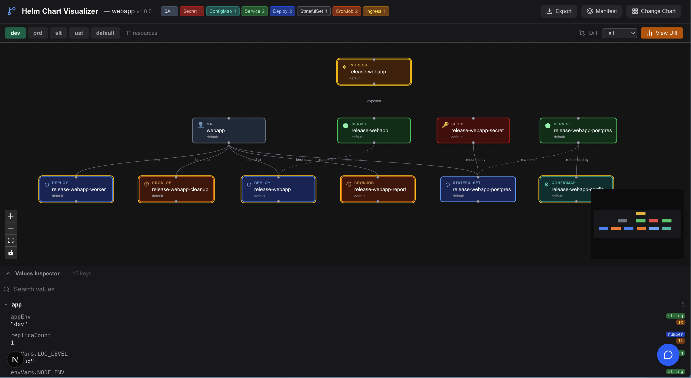

# Helm Chart Visualizer

[](https://github.com/unrealandychan/Helm-Visualizer)

An interactive, browser-based Helm chart renderer and Kubernetes resource graph — uses Helm CLI when available, falls back to pure-JS renderer, no cluster access required.

Paste an Artifact Hub URL, upload a `.tgz` chart, or load the chart from your own workspace. Switch environments, diff configs, and explore every rendered resource.

> **Source:** [https://github.com/unrealandychan/Helm-Visualizer](https://github.com/unrealandychan/Helm-Visualizer)



---

## Features

| Feature | Description |
|---|---|
| **Workspace chart** | Auto-loads the `helm/` directory in the repo and renders it across all environments |
| **Upload `.tgz`** | Drag-and-drop any packaged Helm chart for instant visualization |
| **Artifact Hub / OCI** | Load charts directly from `artifacthub.io` URLs, including OCI-hosted charts |
| **Search** | Live search against the Artifact Hub API; click a result to load it |
| **Popular charts** | One-click quickload for nginx, grafana, cert-manager, and more |
| **Multi-environment** | Renders every `values.<env>.yaml` file and lets you switch between them |
| **Env diff** | Select a comparison environment — changed nodes glow amber |
| **Values Inspector** | Explore the merged values tree; hover to highlight which resources use each key |
| **Resource detail** | Click any node on the graph for a full YAML view of the resource |
| **Export YAML** | Download the rendered manifests for the active environment |
| **Chart history** | Recent charts persist to localStorage for quick re-access |
| **Kind badges** | Header shows a live count of each resource kind in the active environment |
| **Resource relationships** | Edges show how resources connect: `routes to`, `exposes`, `bound to`, `mounted by`, `referenced by` |
| **Pure-JS renderer** | Go templates processed entirely in-browser when Helm CLI unavailable — no server-side helm binary |
| **AI Chat Assistant** | Floating chatbot panel — ask natural-language questions about the loaded chart's resources, values, and configuration |

---

## Quick Start

```bash
npm install
npm run dev
```

Open http://localhost:3000. The workspace chart (`helm/`) is loaded automatically.

To enable the AI Chat Assistant, copy `env.example` to `.env.local`, set your `OPENAI_API_KEY`, then restart the dev server (see [LLM Chat Assistant](#llm-chat-assistant) for details).

---

## Chart Sources

### Workspace chart
The app reads `helm/` at the project root. Place your `Chart.yaml`, `values.yaml`, environment-specific overrides (`values.dev.yaml`, `values.prd.yaml`, etc.), and templates there.

### Upload
Click **Upload** and drop any `.tgz` Helm chart package (max 50 MB).

### Artifact Hub
1. Find a chart at https://artifacthub.io
2. Copy the package URL (e.g. `https://artifacthub.io/packages/helm/bitnami/nginx`)
3. Paste it into the **Artifact Hub** tab and press Enter

OCI charts (hosted on Docker Hub, GHCR, ECR, etc.) are supported automatically.

---

## Multi-Environment Rendering

The visualizer discovers all `values.<env>.yaml` files next to `values.yaml` and renders each one. Controls appear in the env switcher bar:

- Select the **active environment** to view its graph
- Select a **diff environment** to compare — amber-highlighted nodes have changed resources

---

## LLM Chat Assistant

A floating chat panel (bottom-right corner) lets you ask questions about the currently loaded chart in plain English:

- "How many replicas does the Deployment use in production?"
- "Which resources reference the `image.tag` value?"
- "What Kubernetes version features does this chart rely on?"
- "Suggest improvements to the HPA configuration."

The assistant is aware of the chart's metadata, every rendered Kubernetes resource, and all values keys for the active environment.

### Setup

1. Copy `env.example` to `.env.local`:
   ```bash
   cp env.example .env.local
   ```
2. Set your API key:
   ```
   OPENAI_API_KEY=sk-...
   ```
3. Restart the dev server — the chat button appears in the bottom-right corner of the UI.

### Configuration

| Variable | Required | Default | Description |
|---|---|---|---|
| `OPENAI_API_KEY` | **Yes** | — | API key for OpenAI or any compatible provider |
| `OPENAI_BASE_URL` | No | `https://api.openai.com` | Override to use Azure OpenAI, Groq, Ollama, etc. |
| `OPENAI_MODEL` | No | `gpt-4o-mini` | Model name passed to the chat completions endpoint |

Any OpenAI-compatible API is supported — simply set `OPENAI_BASE_URL` to your provider's endpoint.

---

## Project Structure

```
helm-chart-visualizer/
├── app/
│   ├── page.tsx              # Main page — header, graph, values panel, chatbot
│   └── api/
│       ├── workspace-chart/  # Reads helm/ from the repo
│       ├── upload-chart/     # Accepts multipart .tgz upload
│       ├── fetch-chart/      # Downloads and renders from URL / OCI
│       ├── search-charts/    # Proxies Artifact Hub search API
│       └── chat/             # LLM chat completions (streaming SSE)
├── components/
│   ├── ChartLoader.tsx       # Tab-based chart input modal
│   ├── ResourceGraph.tsx     # React Flow canvas
│   ├── ResourceNode.tsx      # Custom node per Kubernetes kind
│   ├── ResourceDetail.tsx    # YAML sidebar for selected node
│   ├── ValuesInspector.tsx   # Values tree panel
│   ├── EnvSwitcher.tsx       # Environment & diff selector
│   ├── WelcomeScreen.tsx     # Landing screen with feature highlights
│   └── ChatBot.tsx           # Floating LLM chat panel
├── lib/
│   ├── helmTemplateRenderer.ts  # Pure-JS Go template engine
│   ├── graphBuilder.ts          # Builds React Flow nodes/edges from resources
│   └── valuesBuilder.ts         # Extracts & annotates the values tree
├── types/
│   └── helm.ts               # Shared TypeScript types
├── env.example               # Template for .env.local (LLM config)
└── helm/                     # Sample workspace chart (multi-env webapp)
    ├── Chart.yaml
    ├── values.yaml
    ├── values.dev.yaml
    ├── values.sit.yaml
    ├── values.uat.yaml
    ├── values.prd.yaml
    └── templates/
        ├── _helpers.tpl
        ├── deployment.yaml
        ├── worker-deployment.yaml
        ├── service.yaml
        ├── ingress.yaml
        ├── hpa.yaml
        ├── serviceaccount.yaml
        ├── configmap.yaml
        ├── secret.yaml
        ├── postgres.yaml
        └── cronjob.yaml
```

---

## Go Template Engine

`lib/helmTemplateRenderer.ts` implements a pure-JavaScript Go template renderer used as a fallback when Helm CLI is unavailable — no Helm binary, no exec, no network calls at render time.

Supported features:

- `{{- if / else if / else / end }}`
- `{{- range $k, $v := .Values.map }}` and indexed range
- `{{- with }}` scoping
- `{{- define }} / {{- template }} / {{- include }}`
- `toYaml`, `toJson`, `indent`, `nindent`, `quote`, `default`, `required`
- `printf` with `%s`, `%d`, `%f`, `%v`, `%q`, `%x` verbs
- 100+ Sprig functions (`trunc`, `upper`, `lower`, `trim`, `replace`, `hasKey`, `pluck`, `merge`, `kindIs`, ...)
- Recursive template loading from subdirectories and subcharts

---

## Tech Stack

| Layer | Library |
|---|---|
| Framework | Next.js 16 (App Router) |
| Language | TypeScript |
| Styling | Tailwind CSS |
| Graph | @xyflow/react v12 |
| Layout | @dagrejs/dagre |
| YAML | js-yaml |
| Icons | lucide-react |
| LLM | OpenAI-compatible chat completions API (streaming SSE) |

---

## Development

```bash
# Type-check
npx tsc --noEmit

# Build for production
npm run build

# Run production server
npm start
```

---

## Contributing

Contributions are welcome! Please open an issue or submit a pull request on [GitHub](https://github.com/unrealandychan/Helm-Visualizer).

---

## License

Apache 2.0 — see [LICENSE](LICENSE).

---

**GitHub:** [https://github.com/unrealandychan/Helm-Visualizer](https://github.com/unrealandychan/Helm-Visualizer)
